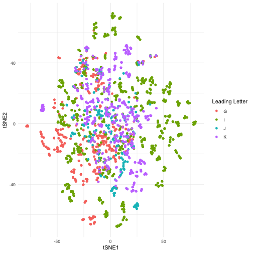

<!-- README.md is generated from README.Rmd. Please edit that file -->


# Compressed, Large-Language-Model Embedded Datasets of ICD-10-CM Descriptions

## Citing this work

```
@article{kane2023llm
  author = {Michael J. Kane and Denise Esserman and Nancy K. Latham and Erich J. Greene and David A. Ganz},
 title = {A Compressed Large Language Model Embedding Dataset of ICD 10 CM Descriptions},
 elocation-id = {2023.04.24.23289046},
 year = {2023},
 doi = {10.1101/2023.04.24.23289046},
 publisher = {Cold Spring Harbor Laboratory Press},
 URL = {https://www.medrxiv.org/content/early/2023/04/26/2023.04.24.23289046},
 eprint = {https://www.medrxiv.org/content/early/2023/04/26/2023.04.24.23289046.full.pdf},
 journal = {medRxiv}
}
```

## License 

The code in this repository is licensed under [GPL v2](https://www.gnu.org/licenses/old-licenses/gpl-2.0.en.html) and the data
are licenced under [CC BY-NC-SA 4.0](https://creativecommons.org/licenses/by-nc-sa/4.0/).

# Funding

This work was supported by the National Institute on Aging of the National Institutes of Health (NIH) through a project grant to Yale University (1R01AG071528). The organizations funding this study had no role in the design or conduct of the study; in the collection, management, analysis, or interpretation of the data; or in the preparation, review, or approval of the manuscript. The content of this publication is solely the responsibility of the authors and does not necessarily represent the official views of the National Institutes of Health, the Department of Veterans Affairs, or the United States government. 

## ICD-10-CM Datasets

### 2022

1. [ICD-10-CM, 10-dimensions](https://github.com/kaneplusplus/icd-10-cm-embedding/blob/main/embedding-data/icd-10-cm-2022-0010.csv.gz?raw=true)
1. [ICD-10-CM, 50-dimensions](https://github.com/kaneplusplus/icd-10-cm-embedding/blob/main/embedding-data/icd-10-cm-2022-0050.csv.gz?raw=true)
1. [ICD-10-CM, 100-dimensions](https://github.com/kaneplusplus/icd-10-cm-embedding/blob/main/embedding-data/icd-10-cm-2022-0100.csv.gz?raw=true)
1. [ICD-10-CM, 1000-dimensions](https://github.com/kaneplusplus/icd-10-cm-embedding/blob/main/embedding-data/icd-10-cm-2022-1000.csv.gz?raw=true)
1. [ICD-10-CM, 1000-dimensions](https://github.com/kaneplusplus/icd-10-cm-embedding/blob/main/embedding-data/icd-10-cm-2022-1000.csv.gz?raw=true)
1. [ICD-10-CM, 42,384-dimensions (not compressed)](https://github.com/kaneplusplus/icd-10-cm-embedding/blob/main/embedding-data/icd-10-cm-2022-full.csv.gz?raw=true)

### 2021

1. [ICD-10-CM, 10-dimensions](https://github.com/kaneplusplus/icd-10-cm-embedding/blob/main/embedding-data/icd-10-cm-2021-0010.csv.gz?raw=true)
1. [ICD-10-CM, 50-dimensions](https://github.com/kaneplusplus/icd-10-cm-embedding/blob/main/embedding-data/icd-10-cm-2021-0050.csv.gz?raw=true)
1. [ICD-10-CM, 100-dimensions](https://github.com/kaneplusplus/icd-10-cm-embedding/blob/main/embedding-data/icd-10-cm-2021-0100.csv.gz?raw=true)
1. [ICD-10-CM, 1000-dimensions](https://github.com/kaneplusplus/icd-10-cm-embedding/blob/main/embedding-data/icd-10-cm-2021-1000.csv.gz?raw=true)
1. [ICD-10-CM, 42,384-dimensions (not compressed)](https://github.com/kaneplusplus/icd-10-cm-embedding/blob/main/embedding-data/icd-10-cm-2021-full.csv.gz?raw=true)

### 2020

1. [ICD-10-CM, 10-dimensions](https://github.com/kaneplusplus/icd-10-cm-embedding/blob/main/embedding-data/icd-10-cm-2020-0010.csv.gz?raw=true)
1. [ICD-10-CM, 50-dimensions](https://github.com/kaneplusplus/icd-10-cm-embedding/blob/main/embedding-data/icd-10-cm-2020-0050.csv.gz?raw=true)
1. [ICD-10-CM, 100-dimensions](https://github.com/kaneplusplus/icd-10-cm-embedding/blob/main/embedding-data/icd-10-cm-2020-0100.csv.gz?raw=true)
1. [ICD-10-CM, 1000-dimensions](https://github.com/kaneplusplus/icd-10-cm-embedding/blob/main/embedding-data/icd-10-cm-2020-1000.csv.gz?raw=true)

### 2019

1. [ICD-10-CM, 10-dimensions](https://github.com/kaneplusplus/icd-10-cm-embedding/blob/main/embedding-data/icd-10-cm-2019-0010.csv.gz?raw=true)
1. [ICD-10-CM, 50-dimensions](https://github.com/kaneplusplus/icd-10-cm-embedding/blob/main/embedding-data/icd-10-cm-2019-0050.csv.gz?raw=true)
1. [ICD-10-CM, 100-dimensions](https://github.com/kaneplusplus/icd-10-cm-embedding/blob/main/embedding-data/icd-10-cm-2019-0100.csv.gz?raw=true)
1. [ICD-10-CM, 1000-dimensions](https://github.com/kaneplusplus/icd-10-cm-embedding/blob/main/embedding-data/icd-10-cm-2019-1000.csv.gz?raw=true)
1. [ICD-10-CM, 42,384-dimensions (not compressed)](https://github.com/kaneplusplus/icd-10-cm-embedding/blob/main/embedding-data/icd-10-cm-2019-full.csv.gz?raw=true)

## Overview

The International Classification of Diseases, 10th Revision, Clinical Modification ([ICD-10-CM](https://www.cdc.gov/nchs/icd/icd-10-cm.htm)) is a standardized classification system used for diagnosing diseases, disorders, and health conditions. It plays a crucial role in analyzing electronic medical records (EMRs) or electronic health records (EHRs). However, the high dimensionality of ICD-10-CM codes and their hierarchical structure make their incorporation into statistical and machine learning analyses challenging. Traditional contrast encoding methods like one-hot and treatment may not fully capture the hierarchical information of the codes. Large language models (LLMs) generate contextualized embeddings that capture the semantic relationships between codes more effectively. This repository provides data sets of ICD-10-CM codes mapped to embeddings generated using the [BioGPT Large Language Model](https://academic.oup.com/bib/article/23/6/bbac409/6713511?guestAccessKey=a66d9b5d-4f83-4017-bb52-405815c907b9&login=false). The embeddings provide informative input features for machine learning models, and dimension-reduced versions in 1,000, 100, 50, and 10 dimensions are provided. Validation for both the dimension reduction and the representation of the embeddings are shown below. The readily available datasets are anticipated to be highly valuable for researchers incorporating ICD-10-CM codes into their analyses, retaining contextual information, and enabling more advanced analyses in the field.

The data sets and code use to generate them are available at https://github.com/kaneplusplus/icd-10-cs-embedding. The data are licensed under the [Creative Commons Attribution-NonCommercial-ShareAlike 4.0 International License](https://creativecommons.org/licenses/by-nc-sa/4.0/legalcode). The code is 
licensed under [GPL-v2](https://www.gnu.org/licenses/old-licenses/gpl-2.0.en.html)

## Model description and performance

The data provided are generated by embedding ICD-10-CM descriptions using the BioGPT-Large model, which tokenizes textual phrases into tokens and maps them to unique vocabulary IDs, resulting in a sequence of continuous embedding vectors. The embeddings are then contextualized by passing them through the model's layers with an attention mask. The embeddings are in a 42,384 dimensional space, which are then compressed using an auto-encoder with fully connected layers of decreasing and increasing sizes until the output layer. The autoencoder structure is the same for models with larger dimensions, with only the appropriate layers retained.

### Validating the dimension reduction


Table: The autoencoder parameters and performance ordered by increasing validation loss.

| Embedding Dimension| Batch Size| Training Loss| Validation Loss|
|-------------------:|----------:|-------------:|---------------:|
|                 100|         64|         0.534|           0.339|
|                 100|        128|         0.487|           0.381|
|                  50|        256|         0.403|           0.392|
|                1000|         64|         0.542|           0.402|
|                 100|        256|         0.556|           0.444|
|                1000|        128|         1.073|           0.486|
|                  10|        256|         0.599|           0.594|
|                  10|        128|         0.628|           0.609|
|                  10|         64|         0.679|           0.641|
|                  50|         64|         1.134|           0.699|
|                1000|        256|        30.435|           0.803|
|                  50|        128|         1.053|           0.894|

The autoencoder compressing the LLM embedding was fit on the 2019 ICD-10-CM descriptions
for 20 epochs, with batch sizes 64, 128, and 256, mean-square error loss between
the embedding and autoencoder estimate, and a validation data set comprised
of random subset of 10\% of the samples. The model performance is shown above.
Based on these results the models with the best validation loss where selected for distribution.


Table: The autoencoder year validation performance ordered by year.

| Year| Embedding Dimension|   MSE| Coef. of Determination|
|----:|-------------------:|-----:|----------------------:|
| 2019|                  10| 0.593|                  0.086|
| 2019|                  50| 0.388|                  0.056|
| 2019|                 100| 0.336|                  0.049|
| 2019|                1000| 0.400|                  0.058|
| 2020|                  10| 0.593|                  0.086|
| 2020|                  50| 0.388|                  0.056|
| 2020|                 100| 0.336|                  0.049|
| 2020|                1000| 0.400|                  0.058|
| 2021|                  10| 0.594|                  0.086|
| 2021|                  50| 0.389|                  0.056|
| 2021|                 100| 0.337|                  0.049|
| 2021|                1000| 0.401|                  0.058|
| 2022|                  10| 0.595|                  0.086|
| 2022|                  50| 0.390|                  0.056|
| 2022|                 100| 0.338|                  0.049|
| 2022|                1000| 0.402|                  0.058|

In addition to the 2019 validation the models selected for distribution were
tested on the 2020-2022 data sets to ensure their performance is comparable
over years. It should be noted that the ICD-10-CM codes do not vary much from
one year to the the next,
so we should not expect large differences. As expected, the mean square error
and coefficients of determination are similar to the 2019 data.

### Validating the embedding representation

To validate the compressed embeddings, the hierarchical information in the ICD-10-CM codes was used to ensure that relevant relationships were preserved. The leading letter and two numeric values categorize codes, allowing for the estimation of categories at a rate higher than chance using a supervised model. The training data was a one-hot encoding of the ICD-10-CM categories as the dependent variable and the compressed embedding values as the independent variable. The model consisted of two hidden layers with 100 nodes each, using categorical cross-entropy as the loss function. The model was trained using 30 epochs, and the performance in terms of accuracy and balanced accuracy was evaluated. The compressed embeddings result in an increase in lost predictive information, as is typical for this type of problem.


Table: The supervised models' performance ordered by increasing embedding dimension.

| Embedding Dimension| Accuracy| Balanced Accuracy|
|-------------------:|--------:|-----------------:|
|                  10|    0.815|             0.698|
|                  50|    0.925|             0.873|
|                 100|    0.935|             0.891|
|                1000|    0.960|             0.927|

Of note, the goal in presenting these results is not to necessarily to 
maximize the prediction accuracy. Rather, it is to show that the embedding retains the
hierarchical information in the ICD-10-CM codes. Some of the codes correspond to
conditions that could be classified in several ways, and as a result coding
for at least some of the conditions might be considered non-systematic.

## An example using the embedding data in R

To conclude, we present a simple example of how one might use the embedding
information in the R programming environment. Suppose we would like to 
visualize the ICD-10-CM codes beginning with G (diseases of the nervous system), 
I (diseases of the circulatory system), J (diseases of the respiratory system), 
and K (diseases of the digestive system) to better understand the relationships
between these categories or specific conditions in the the 50-dimensional 
embedding. For convenience, the projects page includes an `.rds` file
containing the available embeddings along with their URLs, which can be 
retrieved from the R console. The code categores can then be visualized 
by performing another dimension reduction (in this case we will use the
Rtsne package), to 2 dimensions and presented them
to a scatter plot as shown below. 


```r
library(dplyr)
library(ggplot2)
library(readr)
library(Rtsne)
library(stringr)

# Download the locations of the embeddings.
tf = tempfile()
download.file(
  "https://github.com/kaneplusplus/icd-10-cm-embedding/blob/main/icd10_dl.rds?raw=true",
  tf
)
dl = readRDS(tf)

# Read in the unspecified injury codes.
tf = tempfile()
download.file(
  dl$url[dl$year == 2019 & dl$emb_dim == 50],
  tf
)

icd10s = read_csv(tf) |>
  filter(str_detect(code, "^(G|I|J|K)")) |>
  mutate(desc = tolower(desc)) |>
  mutate(`Leading Letter` = str_sub(code, 1, 1)) 

# Fit tSNE to the embedding.
tsne_fit = icd10s |> 
  select(starts_with("V")) |>
  scale() |>
  Rtsne(perplexity = 10)

# Bind the tSNE values to the data set.
icd10p = bind_cols(
  icd10s |>
    select(-starts_with("V")),
  tsne_fit$Y |>
    as.data.frame() |>
    rename(tSNE1="V1", tSNE2="V2") |>
    as_tibble()
)

# Visualize the results.
ggplot(icd10p, aes(x = tSNE1, y = tSNE2, color = `Leading Letter`)) +
  geom_point() +
  theme_minimal()
```



The visualization shows that a subset of the circulatory diseases (I) and
nervous system diseases (G) are well-differentiated from other conditions. It
also shows overlap between other conditions related to K (digestive diseases), 
J (respiratory diseases), and I (circulatory).

## A SAS example

```sas
/* Options */
%let dlyear=2019;     /* code year; can be 2019, 2020, 2021, 2022 */
%let dldim=50;        /* encoding dimensions; can be 1000, 100, 50, 10 */
%let tempdir=D:;      /* directory for temporary file */
%let pathsep=\;       /* path separator; \ for Windows, / for *NIX */
%let dsname=icd10cm;  /* name for the final dataset */
%let target=icd-10-cm-&dlyear-%sysfunc(putn(&dldim,z4.)).csv.gz;
%let tempfile=&tempdir&pathsep&target;

/* Download gzipped file to a temp location */
/* -- filename url and filename zip methods don't stack */
filename rawdl "&tempfile";
proc http
  url="https://github.com/kaneplusplus/icd-10-cm-embedding/raw/main/embedding-data/&target"
  out=rawdl;
run;

/* Read the downloaded temp file into a dataset */
filename codes ZIP "&tempfile" GZIP;
%macro vlist;
  %local i;
  %do i=1 %to &dldim; V&i %end;
%mend;
data &dsname;
  informat code $4. desc $256. %vlist best.;
  infile codes delimiter=',' firstobs=2 dsd;
  input code $ desc $ %vlist;
run;
```

## Reproducing these results

R version: >= 4.2

R package dependencies:
  
  - `arrow`
  - `torch`
  - `reticulate`
  - `dplyr`
  - `tidyr`
  - `purrr`
  - `foreach`
  - `itertoos`
  - `readr`
  - `luz`
  - `tidyr`
  - `tibble`
  - `progress`
  - `stringr`
  - `yardstick`
  
Scripts

- `0-make-embeddings.R`
  - Purpose - create the embeddings created by BioGPT-Large
  - Dependencies
    - A conda evironment with the `torch` and `transformers` packages (see the `make-biogpt-conda-env` script)
  - Inputs
    - `icd-10-cm-codes/icd10cm_codes_2019.txt`
    - `icd-10-cm-codes/icd10cm_codes_2020.txt`
    - `icd-10-cm-codes/icd10cm_codes_2021.txt`
    - `icd-10-cm-codes/icd10cm_codes_2022.txt`
  - Outputs
    - An `icd-10-cm-embeddings` directory with subdirectories corresponding to each year, and subsubdirectories with files whose names correspond to the ICD-10-CM code holding R .rds files with the code, description, and BioGPT embedding values stored as a `data.frame`.
- `1-compress-icd-10-embeddings.R`
  - Purpose - recreate the embeddings created by BioGPT
  - Dependencies
    - R files: `autoencoder.R`
  - Inputs
  - Outputs
- `2-validation.R`
  - Purpose - recreate the embeddings created by BioGPT-Large
  - Dependencies
    - R files: `autoencoder.R`
  - Inputs
    - Files in the `icd-10-cm-embeddings/2019` directory.
  - Outputs
    - `model-performance.rds` holding a `data.frame` consisting of the model performance table.
    - Files in the `autoencoder-models` directory containing model to create the compressed embeddings.
- `3-create-datasets.R`
  - Purpose - recreate the embeddings created by BioGPT-Large
  - Dependencies
    - R files: `autoencoder.R`
  - Inputs
    - Files in the `autoencoder-models` directory.
    - Files in the `icd-10-cm-embeddings` directory for all years (2019-2020).
  - Outputs
    - `year-validation.rds` holding a data frame of the autoencoder year-validation model performance.
    - Files in the `embedding-data` directory holding the embedding values as .csv files for all year-dimension combinations.
- `4-estimate-leading-char.R`
  - Purpose - recreate the embeddings created by BioGPT-Large
  - Dependencies
    - R files: `alpha-char-model.R`
  - Inputs
    - Files in the `embedding-data` directory.
  - Outputs
    - Files in the `luz-supervised-models` directory holding the `luz` package representation of the fitted models.
    - The `supervised-model-perf.rds` files containing a `data.frame` summarizing the supervised model performance.

© Michael J. Kane (kaneplusplus at proton mail dot com)
